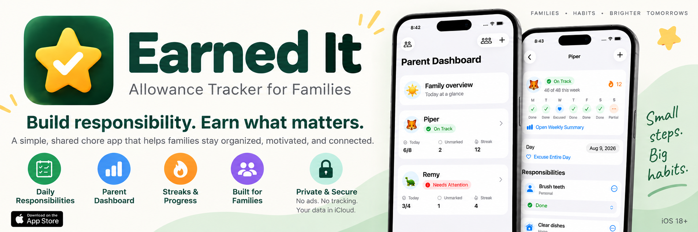

  

# Earned It

A simple shared chore app for families.

**Free. No ads. No tracking.**

Earned It keeps everyday responsibilities clear. Families can organize chores, let children mark their own work, and celebrate progress together in one simple app.

## What it does

- Shares family chore lists between parents and children.
- Provides parent and child roles with appropriate controls.
- Supports recurring weekday chores and as-needed chores.
- Assigns chores to every child, a particular child, or alternating children.
- Lets children mark their own work while parents manage the family.
- Shows weekly progress and streaks.
- Optionally tracks weekly allowance eligibility without moving money.
- Shares through iCloud, synchronizes automatically, and works offline.

## How families use it

A parent creates the family, adds children, and sets up chores. They can invite another parent or a child through iCloud, and each person sees the profile and controls intended for them.

Children check their list and mark chores complete. Parents manage the family name and assignments and follow the family's progress. Changes are saved on the device and synchronize when a connection is available.

## Privacy

**Free. No ads. No tracking.**

Family data is stored locally on each device. When sharing is enabled, it is synchronized through Apple's iCloud and CloudKit infrastructure. Earned It has no advertising, behavioral analytics, third-party tracking, or third-party telemetry SDKs. The developer does not operate a separate server for family data.

Read the full [privacy policy](docs/app-store/privacy-policy.md) and [privacy audit](docs/app-store/privacy-audit.md).

## Requirements

- iPhone running iOS 18 or later
- An iCloud account and network connection for sharing between devices
- Optional camera access for scanning invitation QR codes

A family can also use Earned It locally on one iPhone without enabling sharing.

## Development

Open `EarnedIt.xcodeproj` in Xcode 26.6 or later. Use the `EarnedItCI` scheme for Simulator tests. Live iCloud sharing requires signed devices and separate iCloud accounts.

## Technical documentation

- [Technical overview](docs/technical-overview.md)
- [Shared household architecture and product rules](docs/shared-household-architecture.md)
- [App Store release readiness](docs/app-store/release-readiness.md)

The source is currently published without an open-source license. Public visibility does not grant permission to reuse, modify, or redistribute it.
