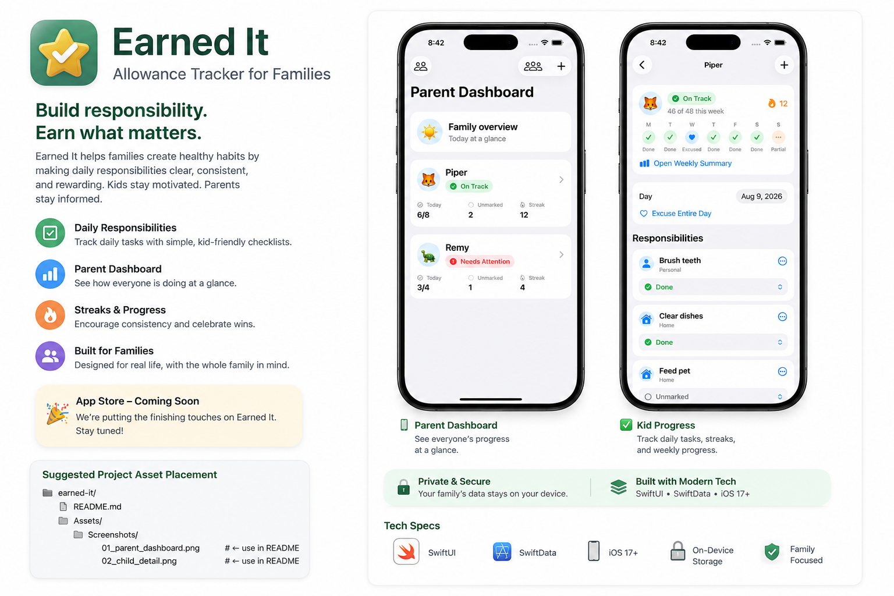

# Earned It

**A simple allowance and responsibility tracker for families.**

Earned It is a native iOS app designed to help kids take ownership of their
daily responsibilities while giving parents an easy way to see how things are
going without constant reminders.



## About

Each child has a simple daily list of responsibilities. Items can be marked as
**Done** or **Not Needed Today**, making it easy to account for everything that
was expected that day.

Parents get a dashboard showing each child's progress, outstanding items,
weekly status, and current streak.

The goal is intentionally simple: encourage consistency and accountability
without turning chores into an elaborate game.

## Features

- Daily responsibility lists
- Separate parent and child experiences
- Parent visibility and overrides
- Weekly allowance progress
- Daily streak tracking
- Excused days
- Custom family member names and avatars
- Daily motivational quotes
- Local persistence
- Accessible, native iOS interface
- No ads

## How Allowance Progress Works

Earned It tracks how consistently responsibilities are accounted for throughout
the week.

- **Green**: 95% or better
- **Yellow**: 85% to under 95%
- **Red**: below 85%
- **85% or better** at the end of the week earns the allowance

Both **Done** and **Not Needed Today** count as accounted for. Items left
unmarked after the day has passed are recorded as missed.

Excused days do not count against progress.

## Built With

- **Swift**
- **SwiftUI**
- **SwiftData**
- **XCTest / XCUITest**
- Native iOS accessibility and Dynamic Type support

The app currently stores family data locally on the device.

## Getting Started

First launch offers a short family setup guide. Add a parent and at least one
child, optionally assign chores, then continue to the parent dashboard. Chores
use the existing weekly allowance eligibility rule; the app does not configure
or pay an allowance amount.

Family names must be distinct within each role, ignoring capitalization and
leading or trailing spaces. You can manage names and add people later in Family
Management from the parent dashboard.

Skip Setup for Now permits an empty household and keeps saved family members,
chores, and the current setup step. With no parent, use Add Parent on the user
picker, then open that profile and use Add Child. Add Chore is available from
an empty child's list.

Use Switch User to reach Settings, where skipped setup can be resumed or setup
can be restarted. Restart keeps household data; Delete All Local Data requires
confirmation and returns to welcome. Production never loads sample households
or automatically removes existing ones. Saved setup progress survives relaunch;
completed or skipped setup does not reopen automatically. Unsaved forms are
discarded when cancelled or the app process ends.

## Development

Run the unit tests and three UI flows with a dedicated iPhone Simulator:

```sh
xcodebuild test -project EarnedIt.xcodeproj -scheme EarnedIt \
  -destination 'platform=iOS Simulator,id=<dedicated-simulator-uuid>' \
  -derivedDataPath .artifacts/DerivedData CODE_SIGNING_ALLOWED=NO
```

The UI tests use a separate persistent store enabled only in Debug builds.
Their reset argument never clears the normal household store.

Earned It is being developed using an agent-first software engineering workflow
with repository-level agent guidance, task-specific skills, automated testing,
and human verification in the iOS Simulator.

The repository includes:

- `AGENTS.md` for canonical agent instructions
- `CLAUDE.md` as a pointer to the canonical instructions
- `skills/` for task-specific agent guidance

## Status

Earned It is currently under active development.

The first native iOS prototype is working and being tested locally using the
iOS Simulator.

**App Store release coming soon.**

## Privacy

Earned It is designed around a simple principle: family data should remain
private.

The current version stores data locally and does not include advertising,
tracking, analytics, or third-party AI services.

## License

This project is currently under development. Licensing information will be
added before public release.
